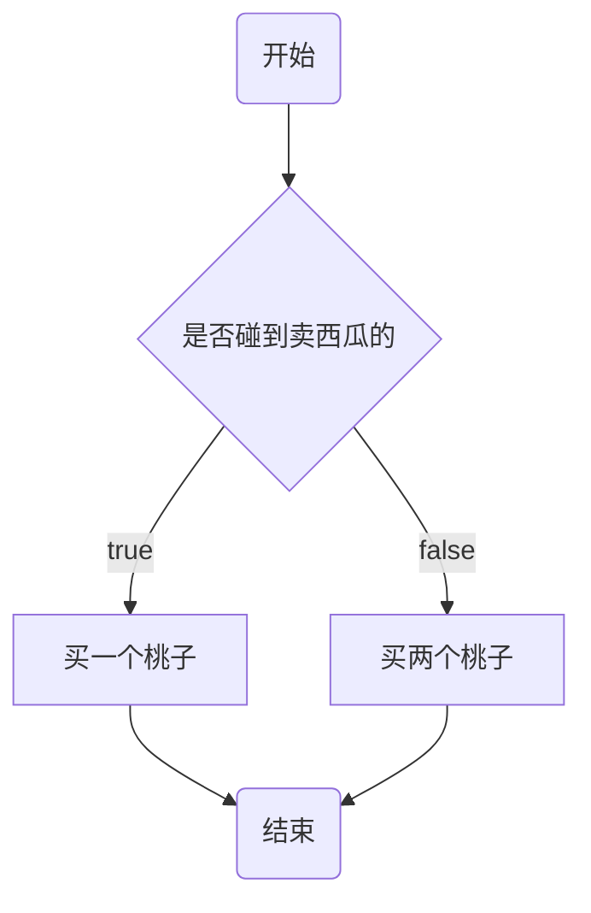

# MarkDown 语法

## 参考资料

[Markdown 官方教程](https://markdown.com.cn/)

[Markdown 使用指南 - 知乎](https://zhuanlan.zhihu.com/p/699944206)

## 基础语法

- 目录：[toc]。
- 标题：在文本前面添加 1 到 6 个井号（#），表示标题的级别。
- 粗体和斜体：
  - 使用双星号（\*\*）包裹文本表示粗体。
  - 使用单星号（\*）或下划线（\_）包裹文本表示斜体。
- 删除线：使用双波浪线（~~）包裹文本表示删除线。
- 下划线：使用&lt;u&gt;标签包裹的文本会有下划线。
- 高亮文本：使用双等于号（`==`）包裹的文本会被高亮。
- 水平线：在单独的一行中使用三个以上的星号、减号或下划线表示水平线。

```markdown
<!-- [toc]表示目录 -->
[toc]

<!-- 标题 -->
# 一级标题
## 二级标题
...
##### 六级标题

**粗体**

_斜体_

**_加粗并斜体_**
***加粗并斜体***

~~删除线文本~~

<u>下划线</u>

==高亮文本==

<!-- 水平线 -->
---
```


## 段落、换行

> 要创建段落，使用空行分隔一行或多行文本即可。

> 要创建换行符，使用`<br/>`即可。

## 有序、无序列表和任务列表

- 列表：
  - 使用星号、加号或减号加空格来创建无序列表。
  - 使用数字加点和空格来创建有序列表。
  - 创建子集列表是使用 tab 键+符号。
- 复选框（任务列表）：
  - 使用`-[]`+空格创建任务列表。
  - 在方括号中，使用空格和字母 x 分别表示未完成和已完成状态。

```markdown
- 无序列表一
  - 无序子集列表
- 无序列表二

1. 有序列表一
	1.1. 有序子集列表一
1. 有序列表二

- [ ] todo1
- [x] todo2
- [ ] todo3
```


## 引用块

> 在段落前添加一个大于符号（>）创建引用块。

```Markdown
> 引用块文本
```


> 引用块可以包含多个段落，在段落之间的空白行上添加一个 >

```markdown
> 第一段文本
>
> 第二段文本
```


> 引用块可以嵌套，在要嵌套的段落前面添加两个 >>

```markdown
> 引用块文本
>
> > 嵌套引用块文本
```


> 带有其他元素的引用块：
>
> - 引用块可以包含其他 Markdown 格式的元素，并非所有元素都可以使用，需要尝试看看哪些元素有效。

```markdown
> #### Markdown 语法的学习
>
> - 什么是 Markdown ？
> - 为什么要用 Markdown ?
> - 支持 Markdown 的应用程序和组件，工具
> - Markdown 文件的工作原理
> - Markdown 的基本语法
>
> **真的真的** 是太好用了，我今天就开始**用起来**
```


## 代码块

> 行内代码：使用单个反引号包裹代码块。
>
> 代码块：使用三个反引号包裹代码块，并指定代码的语言。

~~~markdown
`行内代码`

```javascript
let a = 10;
let b = 20;
console.log(a + b);
```
~~~

## 插入链接

> 写一个`[]()`，在方括号内书写链接描述，在圆括号内书写链接地址。

```html
<!-- 
类型一：跳转到文章某个标题处，链接以#开头，后面跟上标题文本
-->
[跳转到二级标题](#二级标题)

<!-- 
类型二：网址链接
-->
[百度一下](https://www.baidu.com)

<!--
为链接添加title：在URL后使用引号包裹的文本就是title，当鼠标悬浮时会显示
-->
[百度一下](https://www.baidu.com "百度一下，你就知道")

<!--
要将 URL 或 电子邮件地址快速转换为链接，可以将其括在尖括号中。
-->
<https://www.baidu.com>
<qiang.zhang@141data.com>
```


## 插入图片

> 写一个``，在方括号内书写图片的`alt`，在圆括号内书写图片的地址和图片的`title`。

```html
<!-- 
md语法：
对应的HTML代码：
-->


<!--
也可以使用 HTML 标签插入图片
-->


<!--
链接图片：需要将插入图片的MarkDown写在括号中，然后将链接添加到括号中。
其实就是插入链接与插入图片的语法结合。
-->
[](https://www.baidu.com)
```

## 插入表格

> 使用竖线（|）分隔单元格，并使用短划线（-）表示表头和表体的分隔线。
>
> 在第二行短横线左边加个冒号表示居左，两边都加表示居中，右边加表示居右。

```Markdown
| 列一 | 列二 | 列三 |
| :---- | :----: | ----: |
| 项一 | 项二 | 项三 |
| 项一 | 项二 | 项三 |
```


## 进阶语法

[MarkDown 从入门 到 精通，完整版图文教程 | arry老师的博客-艾编程](https://www.arryblog.com/guide/html5/markdown.html#三、markdown-进阶语法)

## 画图

[markdown中流程图、时序图、状态图、类图（UML）语法教程 - 喵师傅 - 博客园](https://www.cnblogs.com/wywblogs/articles/17811904.html)

[【Mermaid 语法详细教程 01】 流程图（Flowchart / graph）_mermaid graph-CSDN博客](https://blog.csdn.net/Tuing_/article/details/129866884)




